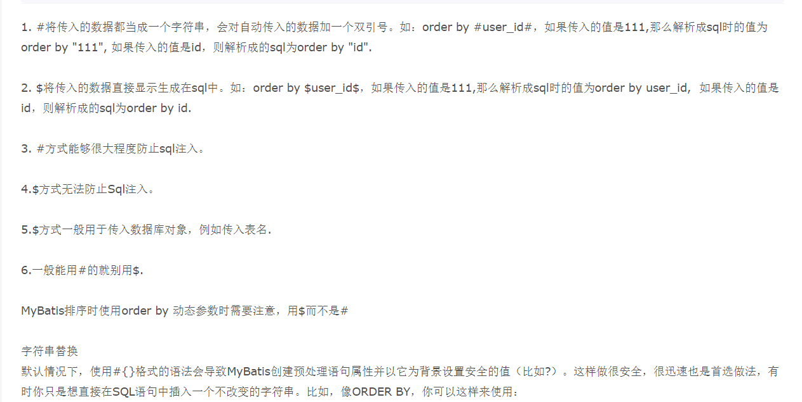

# mybatis 学习笔记

## 0.简介

```
MyBatis 是一款优秀的持久层框架，它支持自定义 SQL、存储过程以及高级映射。MyBatis 免除了几乎所有的 JDBC 代码以及设置参数和获取结果集的工作。MyBatis 可以通过简单的 XML 或注解来配置和映射原始类型、接口和 Java POJO（Plain Old Java Objects，普通老式 Java 对象）为数据库中的记录。
```

## 1.下载安装

**GitHub：[mybatis3.5.2](https://github.com/mybatis/mybatis-3/releases/download/mybatis-3.5.2/mybatis-3.5.2.zip)**

**中文文档：[mybatis中文文档](https://mybatis.org/mybatis-3/zh/index.html)**

**maven仓库**

```xml
<!-- https://mvnrepository.com/artifact/org.mybatis/mybatis -->
<dependency>
    <groupId>org.mybatis</groupId>
    <artifactId>mybatis</artifactId>
    <version>3.5.2</version>
</dependency>

```

**pom.xml**

```xml
<?xml version="1.0" encoding="UTF-8"?>
<project xmlns="http://maven.apache.org/POM/4.0.0"
         xmlns:xsi="http://www.w3.org/2001/XMLSchema-instance"
         xsi:schemaLocation="http://maven.apache.org/POM/4.0.0 http://maven.apache.org/xsd/maven-4.0.0.xsd">
    <modelVersion>4.0.0</modelVersion>

    <groupId>org.suyuesheng</groupId>
    <artifactId>osuo</artifactId>
    <version>1.0-SNAPSHOT</version>
    <repositories>
        <repository>
            <id>alimaven</id>
            <name>aliyun maven</name>
            <url>http://maven.aliyun.com/nexus/content/groups/public/</url>
            <releases>
                <enabled>true</enabled>
            </releases>
            <snapshots>
                <enabled>false</enabled>
            </snapshots>
        </repository>
    </repositories>
    <properties>
        <project.build.sourceEncoding>UTF-8</project.build.sourceEncoding>
        <maven.compiler.source>1.7</maven.compiler.source>
        <maven.compiler.target>1.7</maven.compiler.target>
    </properties>
    <dependencies>
        <dependency>
            <groupId>junit</groupId>
            <artifactId>junit</artifactId>
            <version>4.11</version>
            <scope>test</scope>
        </dependency>
        <dependency>
            <groupId>mysql</groupId>
            <artifactId>mysql-connector-java</artifactId>
            <version>8.0.19</version>
        </dependency>
        <dependency>
            <groupId>com.alibaba</groupId>
            <artifactId>druid</artifactId>
            <version>1.1.22</version>
        </dependency>
        <dependency>
            <groupId>org.springframework</groupId>
            <artifactId>spring-core</artifactId>
            <version>4.1.2.RELEASE</version>
            <scope>compile</scope>
        </dependency>
        <dependency>
            <groupId>org.springframework</groupId>
            <artifactId>spring-jdbc</artifactId>
            <version>4.1.2.RELEASE</version>
            <scope>compile</scope>
        </dependency>
        <dependency>
            <groupId>org.springframework</groupId>
            <artifactId>spring-tx</artifactId>
            <version>4.1.2.RELEASE</version>
            <scope>compile</scope>
        </dependency>
        <dependency>
            <groupId>org.springframework</groupId>
            <artifactId>spring-beans</artifactId>
            <version>4.1.2.RELEASE</version>
            <scope>compile</scope>
        </dependency>
        <dependency>
            <groupId>commons-logging</groupId>
            <artifactId>commons-logging</artifactId>
            <version>1.1.1</version>
            <scope>compile</scope>
        </dependency>
        <dependency>
            <groupId>org.mybatis</groupId>
            <artifactId>mybatis</artifactId>
            <version>3.5.2</version>
        </dependency>
        <dependency>
            <groupId>log4j</groupId>
            <artifactId>log4j</artifactId>
            <version>1.2.17</version>
        </dependency>
    </dependencies>

    <build>
        <resources>
            <resource>
                <directory>src/main/java</directory>
                <includes>
                    <include>**/*.xml</include>
                    <include>**/*.properties</include>
                </includes>
            </resource>
            <resource>
                <directory>src/main/resources</directory>
            </resource>
        </resources>
        <pluginManagement><!-- lock down plugins versions to avoid using Maven defaults (may be moved to parent pom) -->
            <plugins>
                <plugin>
                    <artifactId>maven-clean-plugin</artifactId>
                    <version>3.1.0</version>
                </plugin>
                <!-- see http://maven.apache.org/ref/current/maven-core/default-bindings.html#Plugin_bindings_for_war_packaging -->
                <plugin>
                    <artifactId>maven-resources-plugin</artifactId>
                    <version>3.0.2</version>
                </plugin>
                <plugin>
                    <artifactId>maven-surefire-plugin</artifactId>
                    <version>2.22.1</version>
                </plugin>
                <plugin>
                    <artifactId>maven-war-plugin</artifactId>
                    <version>3.2.2</version>
                </plugin>
                <plugin>
                    <artifactId>maven-install-plugin</artifactId>
                    <version>2.5.2</version>
                </plugin>
                <plugin>
                    <artifactId>maven-deploy-plugin</artifactId>
                    <version>2.8.2</version>
                </plugin>
                <plugin>
                    <groupId>org.apache.maven.plugins</groupId>
                    <artifactId>maven-compiler-plugin</artifactId>
                    <version>3.8.1</version>
                    <configuration>
                        <source>1.8</source>
                        <target>1.8</target>
                        <encoding>utf-8</encoding>
                    </configuration>
                </plugin>
                <plugin>

                    <groupId>org.apache.tomcat.maven</groupId>

                    <artifactId>tomcat7-maven-plugin</artifactId>

                    <version>2.2</version>

                </plugin>
            </plugins>
        </pluginManagement>
    </build>

</project>
```

**sql**

```sql
create database if not exists mybatisstudy character set utf8;
show variables like '%chara%';
use mybatisstudy;
create table user (
    id int not null primary key ,
    name varchar(20) not null ,
    pwd varchar(20) not null
) character set utf8;
desc user;
insert into user values (1,'老张','1234567');
insert into user values (2,'laoliu','12233');
insert into user values (3,'思思','12233');
SELECT * FROM user;
```

### 1.1创建模块

**mybatis.config.xml**

这是mybatis的配置文件

```xml
<?xml version="1.0" encoding="UTF-8" ?>
<!DOCTYPE configuration
        PUBLIC "-//mybatis.org//DTD Config 3.0//EN"
        "http://mybatis.org/dtd/mybatis-3-config.dtd">
<configuration>
    <environments default="development">
        <environment id="development">
            <transactionManager type="JDBC"/>
            <dataSource type="POOLED">
                <property name="driver" value="com.mysql.cj.jdbc.Driver"/>
                <property name="url" value="jdbc:mysql://localhost:3307/mybatisstudy?characterEncoding=utf-8&amp;useUnicode=true"/>
                <property name="username" value="root"/>
                <property name="password" value="su15990904343"/>
            </dataSource>
        </environment>
    </environments>
        <mappers>
            <mapper resource="UserMapper.xml"/>
        </mappers>
</configuration>
```

***备注：在xml文件中 `&` 需要用` &amp;`来表示，如果 `mysql-connector` 的版本大于6，driver应该是`com.mysql.cj.jdbc.Driver`。***

sqlsession 的util文件

```java
package cn.ssm.suyuesheng.utils;

import org.apache.ibatis.session.SqlSession;
import org.apache.ibatis.session.SqlSessionFactory;
import org.apache.ibatis.session.SqlSessionFactoryBuilder;

import java.io.InputStream;

public class SqlsessionUtil {
    private static SqlSession sqlSession;
    private static SqlSessionFactory sqlSessionFactory;

    static {
        InputStream resourceAsStream = SqlsessionUtil.class.getResourceAsStream("mybatis.config.xml");
        sqlSessionFactory = new SqlSessionFactoryBuilder().build(resourceAsStream);
        sqlSession = sqlSessionFactory.openSession();
    }

    public static SqlSession getSqlSession() {
        return sqlSession;
    }

    public static SqlSessionFactory getSqlSessionFactory() {
        return sqlSessionFactory;
    }
}

```

**mapper的配置   <a href="#mapperconfig">跳转到mapper详细配置</a>**

```xml
<?xml version="1.0" encoding="UTF-8" ?>
<!DOCTYPE mapper
        PUBLIC "-//mybatis.org//DTD Mapper 3.0//EN"
        "http://mybatis.org/dtd/mybatis-3-mapper.dtd">
<mapper namespace="cn.ssm.suyuesheng.Dao.UserDao">
    <select id="findAll" resultType="cn.ssm.suyuesheng.domain.User">
    select * from user
  </select>
</mapper>
```

**注意：`namespace`  和`resultType`应该把路径写全，`id`对应的是方法名称，`namespace`对应的是DAO类(在mybatis里叫Mapper类)。_在这里我将`UserMapper.xml`放在了src/main/resourse里面，如果把`UserMapper.xml`放在src/main/java里面需要在pom.xml里面配置过滤_**

#### 过滤这样配置

```xml
<resources>
      <resource>
        <directory>src/main/java</directory>
        <includes>
          <include>**/*.xml</include>
          <include>**/*.properties</include>
        </includes>
      </resource>
      <resource>
        <directory>src/main/resources</directory>
      </resource>
    </resources>
```

**`filtering`默认是false，故不配置`filtering`。待到需要的时候可以自行配置**

## 2 .使用模块

```java
package cn.ssm.suyuesheng.Dao;

import cn.ssm.suyuesheng.domain.User;
import cn.ssm.suyuesheng.utils.SqlsessionUtil;
import org.apache.ibatis.session.SqlSession;
import org.junit.Test;

import java.util.List;

public class UserDaoTest {
    @Test
    public void TestOne(){
        //方法一
        SqlSession sqlSession = SqlsessionUtil.getSqlSession();
        UserDao mapper = sqlSession.getMapper(UserDao.class);
        List<User> users = mapper.findAll();
        System.out.println(users);
        sqlSession.close();
    }
    @Test
    public void TestTwo(){
        //方式二
        SqlSession sqlSession = SqlsessionUtil.getSqlSession();
        List<User> list = sqlSession.selectList("cn.ssm.suyuesheng.Dao.UserDao.findAll");
        for (User user : list) {
            System.out.println(user);
        }
    }
}

```

### 2.1mapper(映射器)详细配置

*参考资料   https://mybatis.org/mybatis-3/zh/sqlmap-xml.html#insert_update_and_delete*

#### 2.1.1 crud的实现

**接口**

```java
package cn.ssm.suyuesheng.Dao;

import cn.ssm.suyuesheng.domain.User;

import java.util.List;

public interface UserDao {
    List<User> findAll();

    User findById(int id);

    boolean insertUser(User user);

    boolean update(User user);

    boolean remove(int id);
}

```

这个接口有增查删改等功能，功能的实现要到对应mapper的xml文件去声明

#### 2.1.2**UserMapper.xml**👇

```xml
<?xml version="1.0" encoding="UTF-8" ?>
<!DOCTYPE mapper
        PUBLIC "-//mybatis.org//DTD Mapper 3.0//EN"
        "http://mybatis.org/dtd/mybatis-3-mapper.dtd">
<mapper namespace="cn.ssm.suyuesheng.Dao.UserDao">
<!--    findAll方法-->
    <select id="findAll" resultType="cn.ssm.suyuesheng.domain.User">
    select * from user
    </select>

<!-- findById-->
    <select id="findById" parameterType="int" resultType="cn.ssm.suyuesheng.domain.User">
        select * from user where id=#{id}
    </select>
<!-- insertUser-->
    <insert id="insertUser" parameterType="cn.ssm.suyuesheng.domain.User">
        insert into user values(#{id},#{name},#{pwd})
    </insert>
<!-- update-->
    <update id="update" parameterType="cn.ssm.suyuesheng.domain.User">
        UPDATE user SET pwd=#{pwd},name=#{name} where id=${id}
    </update>
<!-- remove-->
    <delete id="remove" parameterType="int" >
        delete from user where id=${id}
    </delete>
</mapper>
```

**namespace**  对应接口名称

> 命名解析: 为了减少输入量，MyBatis对所有的命名配置元素(包括语句，结果映射，缓存等)使用了如下的命名解析规则。
>
> - 完全限定名(比如"com.mypackage.MyMapper.selectAllThings")将被直接查找并且找到即用。
> - 短名称(比如"selectAllThings")如果全局唯一也可以作为一个单独的引用。如果不唯一，有两个或两个以上的相同名称(比如“com.foo.selectAllThings ”和“com.bar.selectAllThings”), 那么使用时就会收到错误报告说短名称是不唯一的，这种情况下就必须使用完全限定名。
>
> 原文链接：https://blog.csdn.net/weixin_36210698/article/details/82992771

**mapper里面的四个标签`select`、`update`、`insert`和`delete`对应sql的增查删改**

*具体请到 https://mybatis.org/mybatis-3/zh/sqlmap-xml.html#insert_update_and_delete*

- select 标签的几个重要参数参数
  - `id` 方法名称
  - `parameterType`  参数类
    - **参数类的使用：参数类需要和接口中定义的一样，在标签里使用时要`${参数名称(和在接口中定义的一致)}`；如果参数类不是基础数据类型而是一个正常的类的话，在标签里使用要`${类的参数名称}`。**比方说 `resultType`是`User`，`User`类里面有`name`、`id`、`pwd`三个参数。那么在标签里填写sql语句时要是用`User`类的参数应该这样(假设select操作)：`select * from user where id=${id} and name=${name} and pwd=${pwd}`。*注意`${}`里面的参数名称和`User`类的参数名称一致*
    - 
  - `resultType` 返回类
- update delete insert 的几个重要参数
  - `id` 方法名称
  - `parameterType`  参数类

**mapper.xml配置文件👇**

```xml
<?xml version="1.0" encoding="UTF-8" ?>
<!DOCTYPE mapper
        PUBLIC "-//mybatis.org//DTD Mapper 3.0//EN"
        "http://mybatis.org/dtd/mybatis-3-mapper.dtd">
<mapper namespace="ssm.suyuesheng.mapper.UserMapper">
    <resultMap id="UserMap" type="ssm.suyuesheng.domain.User">
        <result column="pwd" property="password"/>
    </resultMap>
    <select id="findAll" resultMap="UserMap">
        select *  from user
    </select>

    <select id="findById" parameterType="_int" resultType="user">
        select id,name,pwd from user where id=#{id}
    </select>

    <delete id="removeById" parameterType="_int">
        delete from user where id=#{id}
    </delete>

    <update id="update" parameterType="user">
        update user set name=#{name},pwd=#{password} where id=#{id}
    </update>
</mapper>
```


**使用定义的sql语句**👇

```java
public void TestCRUD(){
        //update
        SqlSession sqlSession = SqlsessionUtil.getSqlSession();
        UserDao mapper = sqlSession.getMapper(UserDao.class);
        User user = mapper.findById(5);
        user.setName("老李");
        user.setPwd("hesu1244");
        boolean update = mapper.update(user);
        System.out.println(update);
        sqlSession.commit();
        mapper.findAll().forEach(System.out::println);
        //delete
        mapper.remove(1);
        sqlSession.commit();

    }
```

**请注意：增删改操作完成后一定要` sqlSession.commit();`来提交事务**

## 3.xml配置

https://mybatis.org/mybatis-3/zh/configuration.html#environments

### 配置文件的文档结构


### `properties`和`environments`配置

- `<properties resource="cn/ssm/suyuesheng/mybatisconfig.properties"/>`指定了properties后可以在后面以`${属性名称}`来使用如👇

```xml
<environments default="development">
        <environment id="development">
            <transactionManager type="JDBC"/>
            <dataSource type="POOLED">
                <property name="driver" value="${driver}"/>
                <property name="url" value="${url}"/>
                <property name="username" value="${username}"/>
                <property name="password" value="su15990904343"/>
            </dataSource>
        </environment>
</environments>
```

properties标签内部也可定义属性，当标签定义的属性和resource文件的属性冲突时，以resource指定的文件里的属性之为准**相关属性有可能会和pom.xml冲突，解决冲突的办法有两个，一个是修改`.properties`文件里属性的名称，二是修改过滤规则https://blog.csdn.net/u011781521/article/details/79052725**。按笔记中提到的过滤配置方案就可以避免这种情况

- `事务管理器（transactionManager）`包括JDBC和MANAGED 

- `datasource`数据来源，type属性，有三种内建的数据源类型（也就是 `type="[UNPOOLED|POOLED|JNDI]"`）：可以理解为数据库连接池，`type="UNPOOLED"`就是不用连接池。

- `environments`故名思意支持多个`environment`（`environments`中文可以翻译为工作环境）。但在工作时只能用一个`environment`，用哪个可以在default属性里面设置，如下👇

```xml
<environments default="development">
        <environment id="development">
            <transactionManager type="JDBC"/>
            <dataSource type="POOLED">
                <property name="driver" value="${driver}"/>
                <property name="url" value="${url}"/>
                <property name="username" value="${username}"/>
                <property name="password" value="${password}"/>
            </dataSource>
        </environment>
        <environment id="oracle">
            <transactionManager type="JDBC"></transactionManager>
            <dataSource type="POOLED">
                <property name="driver" value="${driver}"/>
            </dataSource>
        </environment>
</environments>
```

### 类型别名（typeAliases）

类型别名可为 Java 类型设置一个缩写名字。 它仅用于 XML 配置，意在降低冗余的全限定类名书写。如下👇，将`cn.ssm.suyuesheng.domain.User`指定为`User`，这样在`mapper`配置时指定类型更方便

config.xml

```xml
<!--    指定类型别名-->
    <typeAliases>
        <typeAlias type="cn.ssm.suyuesheng.domain.User" alias="User"/>
    </typeAliases>
```

Usermapper.xml

```xml
<select id="findById" parameterType="int" resultType="User">
    select * from user where id=#{id}
</select>
```

`package`指定使用的包，在config里面的aliases里package指定了使用的包之后，使用包里的类可以使用类名称首字母小写👇

config.xml

```xml
 <package name="cn.ssm.suyuesheng.domain"/>
```

Usermapper.xml

```xml
<!--    在config里面的aliases里package指定了使用的包之后，使用包里的类可以使用类名称首字母小写-->
    <insert id="insertUser" parameterType="user">
        insert into user values(#{id},#{name},#{pwd})
    </insert>
```

也可使用注解来定义别名，使用了`package`后，在没有注解的情况下，会使用 Bean 的首字母小写的非限定类名来作为它的别名。 比如 `domain.blog.Author` 的别名为 `author`；若有注解，则别名为其注解值。(此时使用小写依然可以)👇

User.java

```java
@Alias("author")     //必须在typealias指定package后@Alias("")才会有效果
public class User {
    private int id;
    private String name;
    private String pwd;
```

Usermapper.xml

```xml
<!--    使用了`package`后，在没有注解的情况下，会使用 Bean 的首字母小写的非限定类名来作为它的别名。 比如 `domain.blog.Author` 的别名为 `author`；若有注解，则别名为其注解值。-->
    <update id="update" parameterType="author">
        UPDATE user SET pwd=#{pwd},name=#{name} where id=${id}
    </update>
```

为一些基础的类型提供了默认的别名👇


### 设置 setting

暂时先记住下面几个


### 映射器 mappers


推荐使用第一个，第二个忽略，第三和第四个有两个要求  **1.`mapper.xml`文件必须放在`src/main/java`里面；2.`mapper.xml`的命名必须和接口名一样，比如接口名称`UserMapper.java`那么xml的名称应该是`UserMapper.xml`。_需要注意的是，虽然只有三和四的操作方式要求接口和配置文件名称一致，但是应该把这一条要求作为一个规范，也就是说以后接口和配置文件名称要保持一致 _**

### other

先忽略

## 4.生命周期和作用域

## 5.结果映射

```xml
<resultMap id="UserMap" type="ssm.suyuesheng.domain.User">
    <result column="pwd" property="password"/>
</resultMap>
```

## 6.日志工厂

在config.xml里面配置settings 里面的setting


- SLF4J 

- LOG4J （**重点**）

- LOG4J2 

- JDK_LOGGING 

- COMMONS_LOGGING 

- STDOUT_LOGGING （**重点**）

- NO_LOGGING

### LOG4J

 **在mybatis的config.xml**

```xml
<settings>
        <setting name="logImpl" value="LOG4J"/>
</settings>
```

**maven导入**

```xml
<!-- https://mvnrepository.com/artifact/log4j/log4j -->
<dependency>
    <groupId>log4j</groupId>
    <artifactId>log4j</artifactId>
    <version>1.2.17</version>
</dependency>
```

[log4j配置详解](https://www.jianshu.com/p/ccafda45bcea)

#### log4.properties

```properties
log4j.rootLogger=DEBUG,console,rollingFile
#表示Logger会在父Logger的appender里输出，默认为true
log4j.additivity.org.apache=true

# 控制台(console)
log4j.appender.console=org.apache.log4j.ConsoleAppender
#指定日志信息的最低输出级别
log4j.appender.console.Threshold=DEBUG
#表示所有消息都会被立即输出，设为false则不输出，默认值是true
log4j.appender.console.ImmediateFlush=true
#默认值是System.out。
log4j.appender.console.Target=System.out
log4j.appender.console.layout=org.apache.log4j.PatternLayout
log4j.appender.console.layout.ConversionPattern=[%d{yyyy/MM/dd HH:mm:ss,SSS}][%c.%M]%p:%m%n


# 回滚文件(rollingFile)
log4j.appender.rollingFile=org.apache.log4j.RollingFileAppender
log4j.appender.rollingFile.Threshold=WARN
log4j.appender.rollingFile.ImmediateFlush=true
log4j.appender.rollingFile.Append=true
log4j.appender.rollingFile.File=D:/logs/log.log4j
log4j.appender.rollingFile.MaxFileSize=10mb
#指定可以产生的滚动文件的最大数，例如，设为2则可以产生logging.log4j.1，logging.log4j.2两个滚动文件和一个logging.log4j文件。
log4j.appender.rollingFile.MaxBackupIndex=50
log4j.appender.rollingFile.layout=org.apache.log4j.PatternLayout
log4j.appender.rollingFile.layout.ConversionPattern=[%-5p] %d(%r) --> [%t] %l: %m %x %n

# 日志输出级别
log4j.logger.cn.ssm=DEBUG
log4j.logger.java.sql=DEBUG

```

[具体的内容可以到这里](https://www.jianshu.com/p/ccafda45bcea)

**在代码里面使用**

```java
Logger logger = Logger.getLogger(Thread.currentThread().getStackTrace()[1].getClass());
 public void testLogger(){
        logger.error("错误");
        logger.warn("haha");
    }
```

## 7.分页

### 7.1limit(重点)

Dao

```java
    /**
     * 分页
     * @param map
     * @return
     */
    List<User> limit(Map<String,Integer> map);
```

mapper.xml

```xml
<select id="limit" parameterType="map" resultMap="UserMap">
    select * from user limit #{startPage},#{size}
</select>
```

使用👇

```java
@Test
public void testOne(){
    SqlSession sqlSession = SqlsessionUtil.getSqlSession();
    UserDao userDao = sqlSession.getMapper(UserDao.class);

    Map<String,Integer> map = new HashMap<String, Integer>();
    map.put("startPage", 0);
    map.put("size", 2);
    List<User> users = userDao.limit(map);
    System.out.println(users);
    sqlSession.commit();
    sqlSession.close();
    //        userDao.limit()
}
```


### 7.2rowbound（面向对象）

### 7.3pagehelper（插件）

## 8.面向注解


```java
public interface UserMapper {

    List<User> findAll();

    @Insert("insert into user values(#{id},#{name},#{password})")
    boolean insert(User user);

    User findById(@Param("id") int id);
}
```

**以后`@param`如果是基本数据类型就用。**

### $和#的区别

https://blog.csdn.net/u013552450/article/details/72528498




## 9.lombok

### 9.1 简介

> Lombok项目是一个Java库，它会自动插入编辑器和构建工具中，Lombok提供了一组有用的注释，用来消除Java类中的大量样板代码。仅五个字符(@Data)就可以替换数百行代码从而产生干净，简洁且易于维护的Java类。
>
> 来源百度百科  https://baike.baidu.com/item/Lombok/23780246?fr=aladdin

### 9.2 安装

*在idea安装*


*导包*

```xml
<!-- https://mvnrepository.com/artifact/org.projectlombok/lombok -->
<dependency>
    <groupId>org.projectlombok</groupId>
    <artifactId>lombok</artifactId>
    <version>1.18.8</version>
    <!-- scope 可以去掉 -->
    <scope>provided</scope>
</dependency>
```

### 9.3 使用

> 常用注解：
>
> @Setter ：注解在类或字段，注解在类时为所有字段生成setter方法，注解在字段上时只为该字段生成setter方法。
>
> @Getter ：使用方法同上，区别在于生成的是getter方法。
>
> @ToString ：注解在类，添加toString方法。
>
> @EqualsAndHashCode： 注解在类，生成hashCode和equals方法。
>
> @NoArgsConstructor： 注解在类，生成无参的构造方法。
>
> @RequiredArgsConstructor： 注解在类，为类中需要特殊处理的字段生成构造方法，比如final和被@NonNull注解的字段。
>
> @AllArgsConstructor： 注解在类，生成包含类中所有字段的构造方法。
>
> @Data： 注解在类，生成setter/getter、equals、canEqual、hashCode、toString方法，如为final属性，则不会为该属性生成setter方法。
>
> @Slf4j： 注解在类，生成log变量，严格意义来说是常量。

java代码这样写👇

```java
@Alias("student")
@Data
@AllArgsConstructor
@NoArgsConstructor
public class User {
    private int id;
    private String name;
    private String password;
}
```

因为添加了几个注解，好多方法就自动生成了👇


## 10 多对一

假设学生和老师 老师一个，学生多个

### sql语句

```sql
show databases ;
use mybatisstudy;
show tables ;
select * from user;
show create table user;
create table `teacher`(
    `id` int primary key ,
    `name` varchar(20) not null
)default charset=utf8;
insert into teacher values (1,'老程');
select * from teacher;
create table `student`(
    `id` int primary key ,
    `name` varchar(20) not null ,
    `tid` int,
    constraint `t-sid` foreign key (`tid`) references `teacher` (`id`)
)default charset=utf8;
desc student;
insert into student values(1,'老黑',1);
insert into student values(2,'老柳',1);
insert into student values(3,'老六',1);
insert into student values(4,'老苏',1);
insert into student values(5,'老李',1);
select * from student;
```

*关系👇*


### 环境搭建流程

pom.xml继承父pom.xml

1. 建立实体类

   1. ```java
      @Data
      @NoArgsConstructor
      @AllArgsConstructor
      public class Student {
          private int id;
          private String name;
          /**
           * 关联老师
           */
          private Teacher teacher;
          private int tid;
      }
      ```

   2. ```java
      @Data
      @AllArgsConstructor
      @NoArgsConstructor
      public class Teacher {
          private int id;
          private String name;
      }
      ```

2. 建立mapper接口

   1. ```java
      public interface StudentMapper {
      
          List<Student> findAll();
      
      
      }
      ```

   2. ```java
      public interface TeacherMapper {
      }
      ```

3. 建立config.xml

   1. ```xml
      <?xml version="1.0" encoding="UTF-8" ?>
      <!DOCTYPE configuration
              PUBLIC "-//mybatis.org//DTD Config 3.0//EN"
              "http://mybatis.org/dtd/mybatis-3-config.dtd">
      <configuration>
          <properties resource="mybatisconfig.properties"/>
          <settings>
              <setting name="logImpl" value="LOG4J"/>
          </settings>
          <typeAliases>
              <package name="ssm.suyuesheng.domain"/>
          </typeAliases>
          <environments default="development">
              <environment id="development">
                  <transactionManager type="JDBC"></transactionManager>
                  <dataSource type="POOLED">
                      <property name="driver" value="${driver}"/>
                      <property name="url" value="${url}"/>
                      <property name="username" value="${username}"/>
                      <property name="password" value="${password}"/>
                  </dataSource>
              </environment>
          </environments>
          <mappers>
              <package name="ssm.suyuesheng.mapper"/>
          </mappers>
      </configuration>
      ```

4. 建立mapper.xml

   1. ```xml
      <?xml version="1.0" encoding="UTF-8" ?>
      <!DOCTYPE mapper
              PUBLIC "-//mybatis.org//DTD Mapper 3.0//EN"
              "http://mybatis.org/dtd/mybatis-3-mapper.dtd">
      <mapper namespace="ssm.suyuesheng.mapper.StudentMapper">
          <resultMap id="studentMap" type="ssm.suyuesheng.domain.Student">
      
          </resultMap>
      
          <select id="findAll" resultType="student">
              select * from student
          </select>
      </mapper>
      ```

   2. ```xml
      <?xml version="1.0" encoding="UTF-8" ?>
      <!DOCTYPE mapper
              PUBLIC "-//mybatis.org//DTD Mapper 3.0//EN"
              "http://mybatis.org/dtd/mybatis-3-mapper.dtd">
      <mapper namespace="ssm.suyuesheng.mapper.TeacherMapper">
      
      </mapper>
      ```

5. 实验环境搭建是否成功

   1. ```java
      package ssm.suyuesheng.mapper;
      
      import org.apache.ibatis.session.SqlSession;
      import org.junit.Test;
      import ssm.suyuesheng.util.SqlSessionUtil;
      
      public class TestStudent {
          @Test
          public void testStart(){
              SqlSession sqlSession = SqlSessionUtil.getSqlSession();
              StudentMapper mapper = sqlSession.getMapper(StudentMapper.class);
              System.out.println(mapper.findAll());
          }
      }
      ```